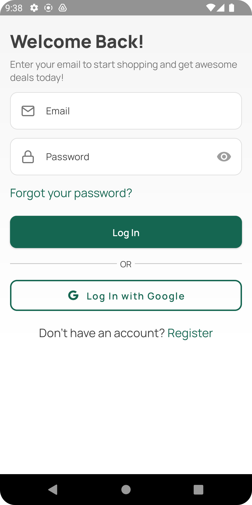
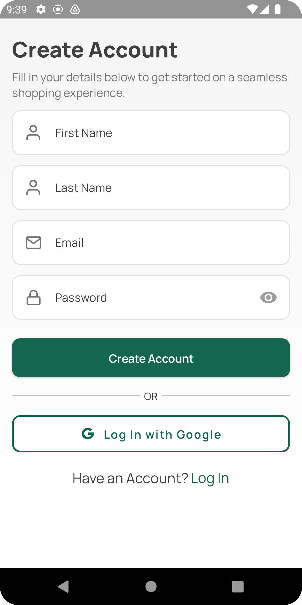
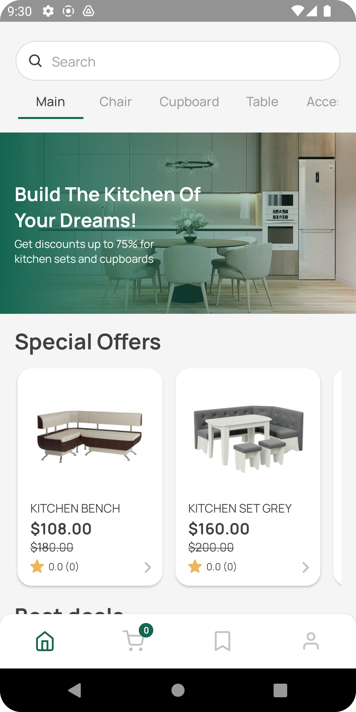
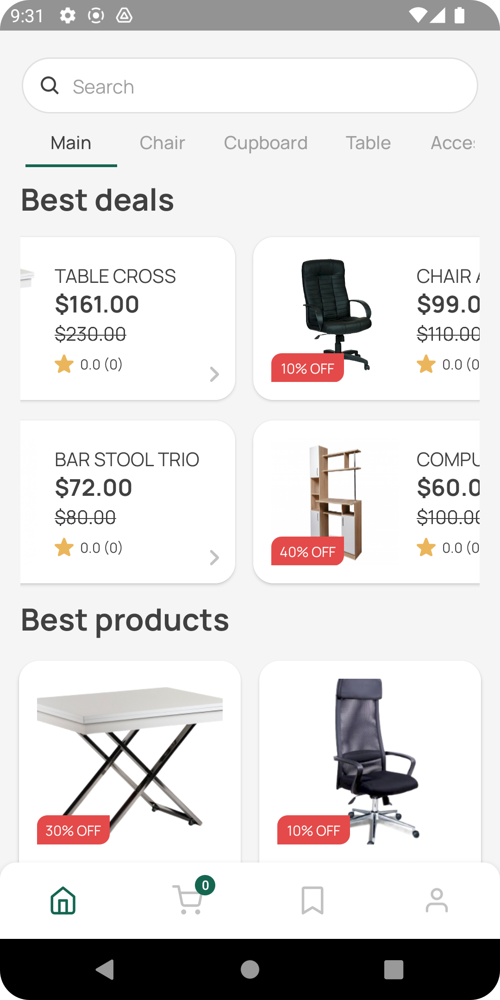
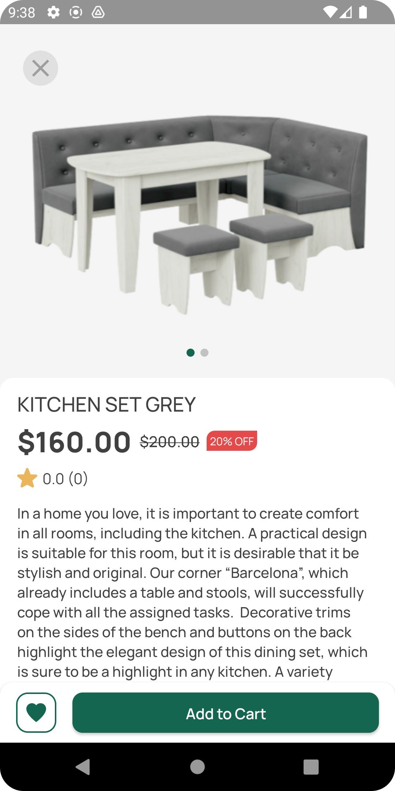
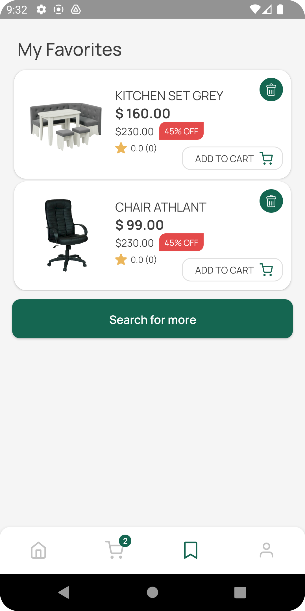
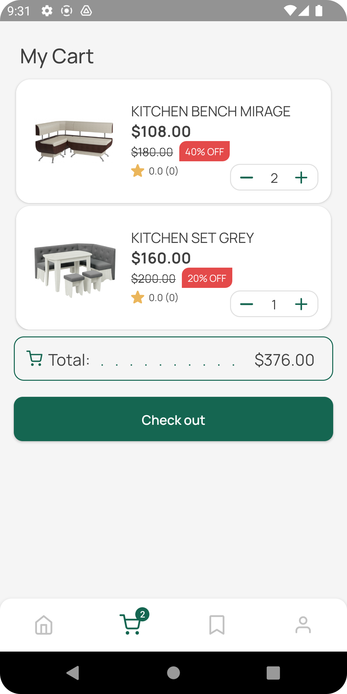
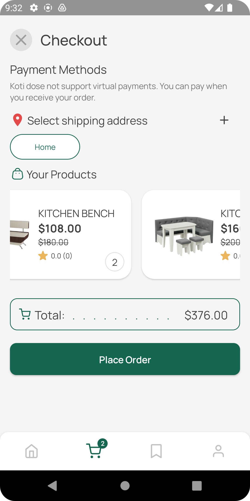
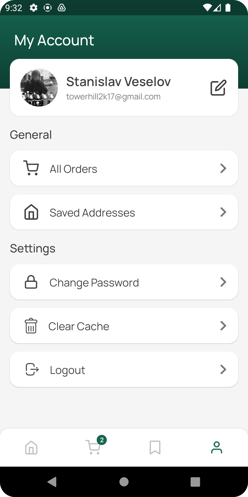
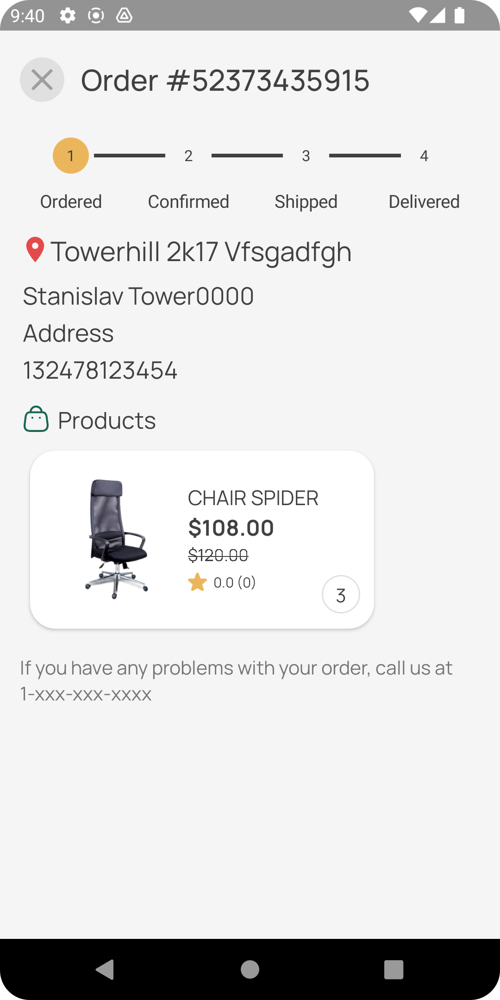

# Кoti Furniture Store

This is a pet project for a furniture store, showcasing the implementation of Clean Architecture, MVVM pattern, Hilt for dependency injection, Coroutines for asynchronous programming, Firebase for authentication and data storage, and Room for caching.

## Technologies Used

- **Clean Architecture**
- **MVVM**
- **Hilt**
- **Kotlin Coroutines**
- **Firebase**
- **Room**
  
## Screenshots

                  

## Features

The app has the following features:

- User authentication (sign up, sign in, sign out)
- Browse furniture items by category
- Search for furniture items by name or description
- Add furniture items to cart
- Add items to favorites
- View cart items and total price
- Checkout cart items and place order
- View order history
- Change profile info
- Clean app cache
- Add and remove shipping addresses

## Getting Started

To run the project locally, follow these steps:

1. Clone the repository:
   ```bash
   git clone https://github.com/tower0000/android-furniture-store-app.git
2. Open the project in Android Studio
3. Build and run the app on an emulator or physical device
